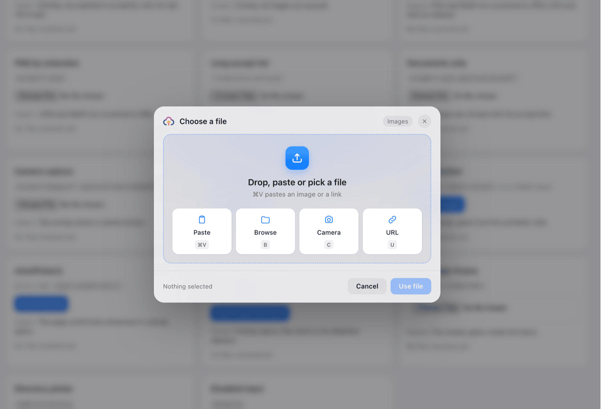
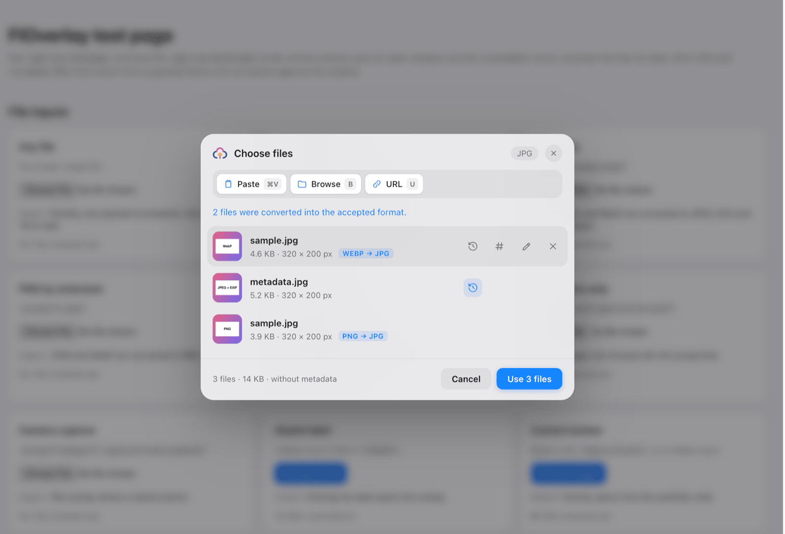
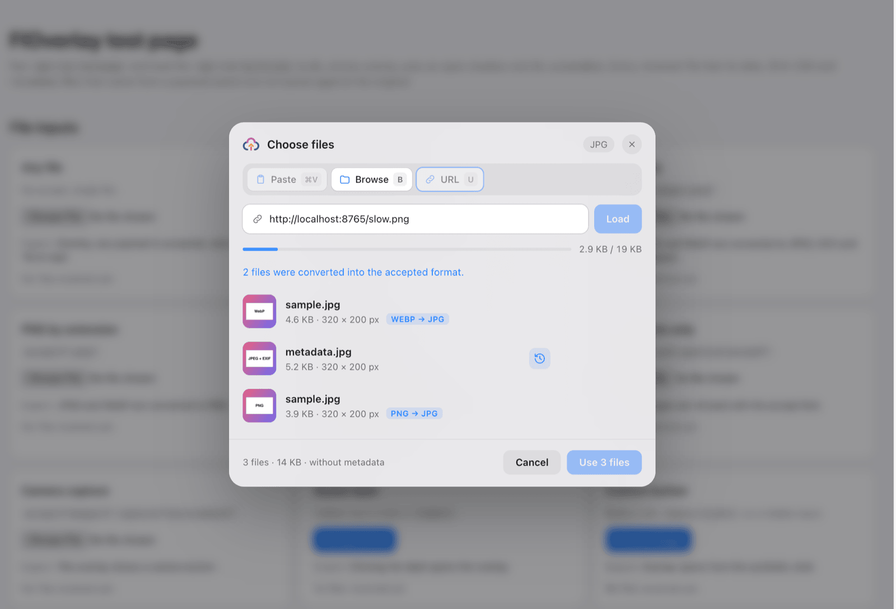
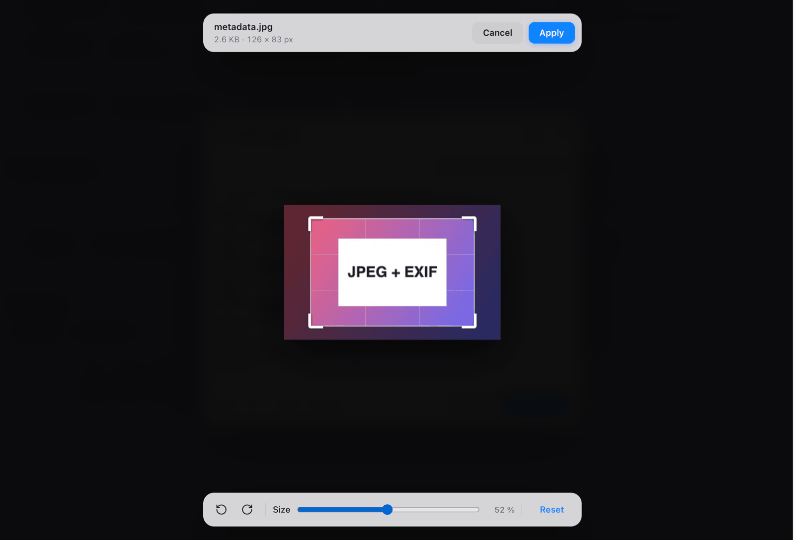
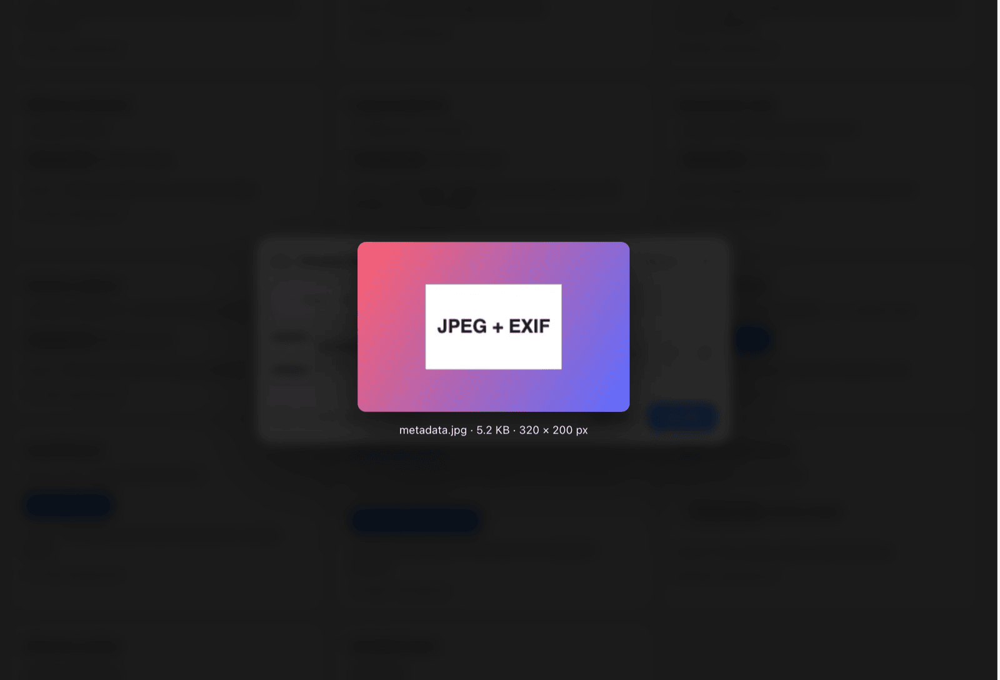
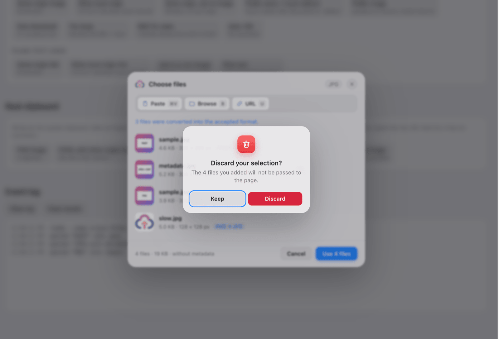
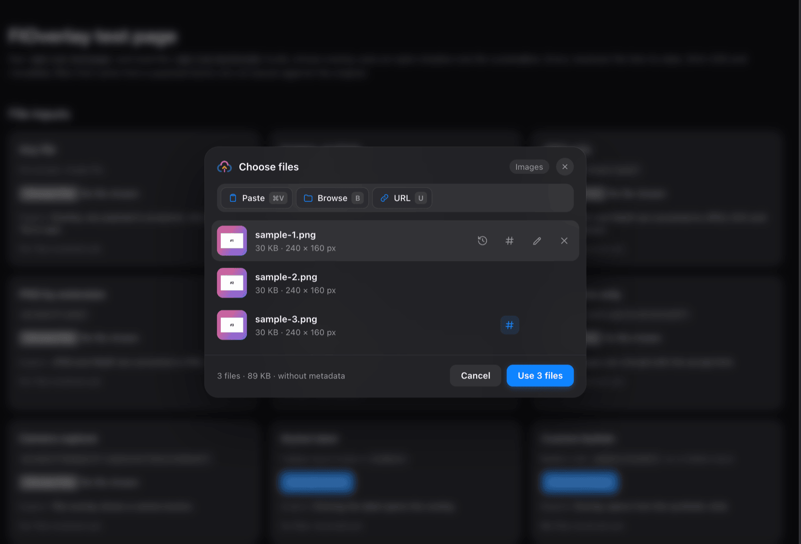
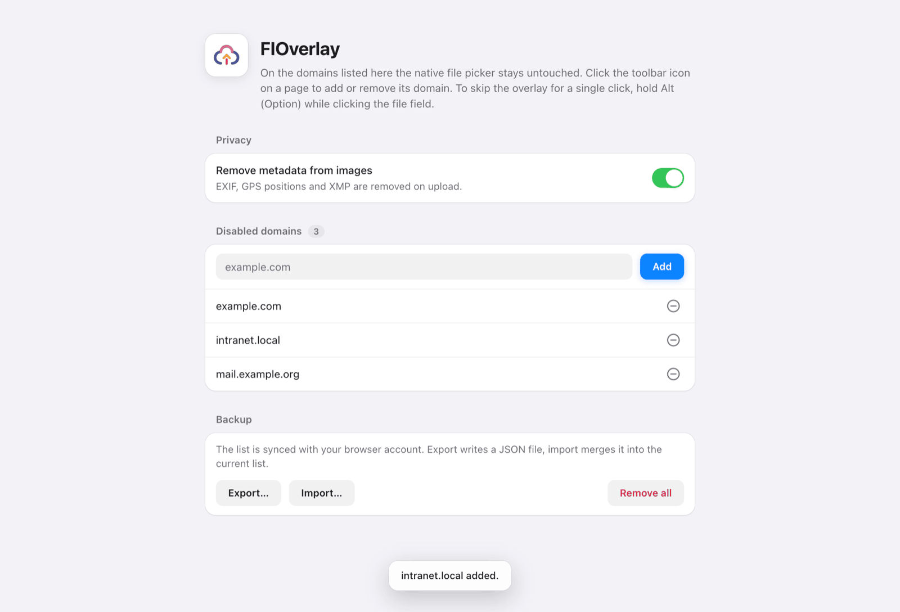

# FIOverlay

FIOverlay gives file upload fields a better picker. Paste, drop, or download a file, review it before uploading, then send it to the site as usual.

Works in Chrome and Firefox. Completely AI-generated. I don't take feature requests. Install from Releases section, needs a browser that doesn't enforce "signing".

## What you can do

- Paste files, copied images and image links with <kbd>Ctrl</kbd>/<kbd>⌘</kbd>+<kbd>V</kbd>.
- Drop files anywhere on the page while the picker is open.
- Add a file from a URL.
- Open each source with a single key, shown next to it (in English: <kbd>B</kbd>rowse, <kbd>C</kbd>amera, <kbd>U</kbd>RL).
- Take a photo with your camera when the field asks for one.
- Choose files from your device.
- Check image previews, file sizes, and dimensions before uploading.
- Crop, rotate, and scale an image right in the picker.
- Rename a file by clicking its name in the list.
- Can overwrite date with current date per file
- Give an image a different file hash per file. The picture is written again with a pixel change you cannot see, so the upload does not match a copy you sent somewhere else.
- Drag the entries to change the order they are handed over in.
- Get an image converted automatically when the field only accepts other formats.
- Confirm the selection with <kbd>Enter</kbd>, close the overlay with <kbd>Esc</kbd>.
- Use <kbd>Alt</kbd>/<kbd>Option</kbd>+click when you want to open the browser's normal file picker.
- Let FIOverlay strip EXIF, GPS positions, and XMP from JPEG, PNG, and WebP uploads. This is on by default and can be switched off in the settings.
- Turn FIOverlay off for individual websites from the toolbar icon. Your disabled-site list syncs between browsers and can be exported from the settings page.

## Development

```bash
npm install
npm run dev
```

For Firefox, use `npm run dev:firefox`.

```bash
npm run build
npm run lint:types
npm run lint:code
npm test
```

### Test page

`npm run testpage` serves a test page at <http://localhost:8765/>. It has file inputs for the
supported cases and payloads to paste into them: files with metadata, links to images on the local
network, slow and oversized downloads. For every file a page receives, it shows the date, SHA-256
and metadata, compared with the original.

`npm run build:e2e` (or `build:e2e:firefox`) builds to `.output/<browser>-mv3-e2e`, where the
overlay uses an open shadow root so browser automation can reach it. The test page exposes
`window.fio` for scripts: `await fio.paste('jpeg-meta', 'images')` opens the overlay on an input and
pastes a payload, `fio.results` holds what the inputs received.

## Release

Run `npm run release <version>` to build and package both browser versions, create the release files, and publish a GitHub release.

## Screenshots

Click an image for the full size.

<table>
  <tr>
    <td width="50%"><a href="screenshots/picker.png"></a><br><sub>Paste, browse, camera or URL, each with its own key</sub></td>
    <td width="50%"><a href="screenshots/files.png"></a><br><sub>Files are converted when the field wants another format</sub></td>
  </tr>
  <tr>
    <td><a href="screenshots/url.png"></a><br><sub>Download a file from a URL</sub></td>
    <td><a href="screenshots/editor.png"></a><br><sub>Crop, rotate and scale, with the file size shown live</sub></td>
  </tr>
  <tr>
    <td><a href="screenshots/preview.png"></a><br><sub>Large preview</sub></td>
    <td><a href="screenshots/discard.png"></a><br><sub>Closing asks before your files are thrown away</sub></td>
  </tr>
  <tr>
    <td><a href="screenshots/dark.png"></a><br><sub>Dark mode</sub></td>
    <td><a href="screenshots/options.png"></a><br><sub>Settings</sub></td>
  </tr>
</table>
