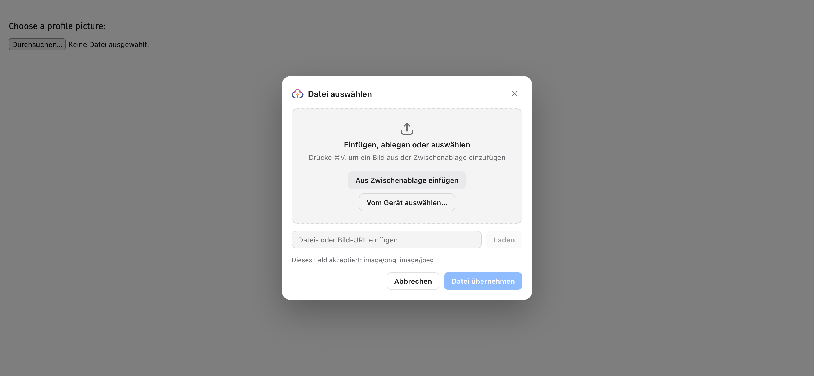
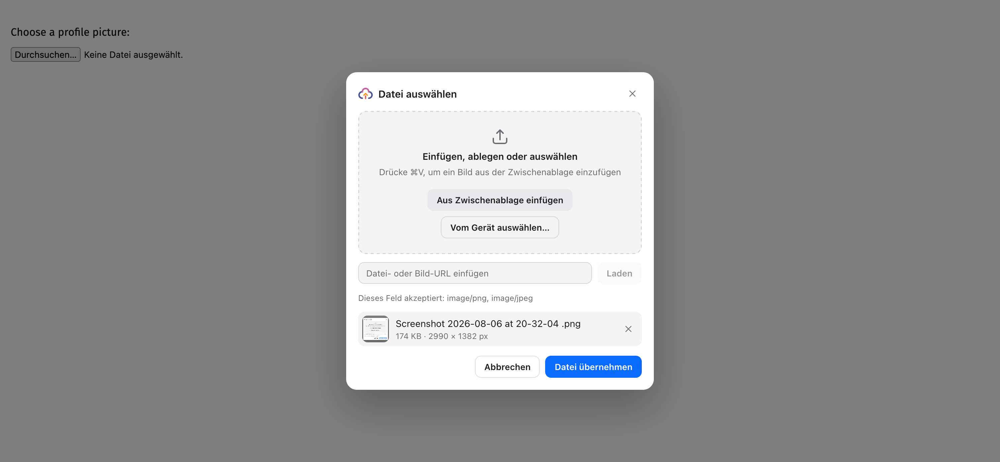
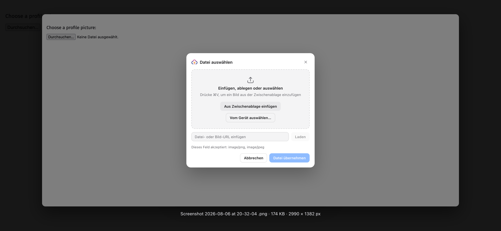
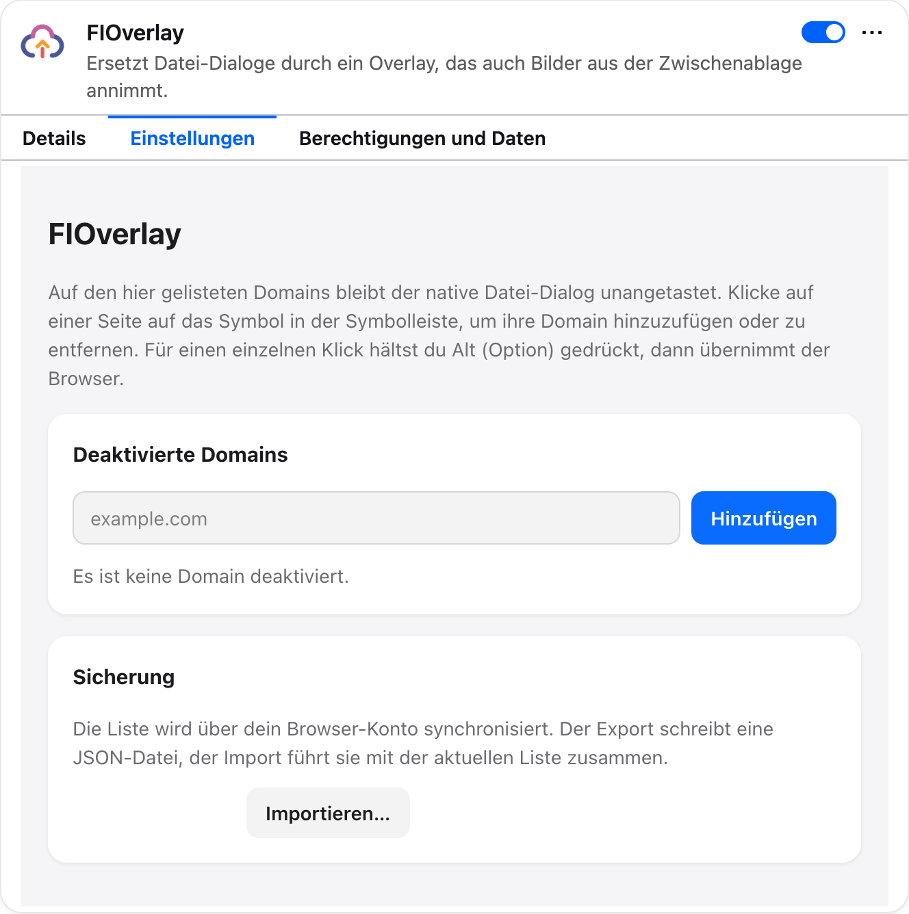

# FIOverlay

FIOverlay gives file upload fields a better picker. Paste, drop, or download a file, review it before uploading, then send it to the site as usual.

Works in Chrome and Firefox. Completely AI-generated. I don't take feature requests. Install from Releases section, needs a browser that doesn't enforce "signing".

## What you can do

- Paste files and copied images with <kbd>Ctrl</kbd>/<kbd>⌘</kbd>+<kbd>V</kbd>.
- Drag files into the picker.
- Add a file from a URL.
- Take a photo with your camera when the field asks for one.
- Choose files from your device.
- Check image previews, file sizes, and dimensions before uploading.
- Crop, rotate, and scale an image right in the picker.
- Rename a file by clicking its name in the list.
- Can overwrite date with current date per file
- Give an image a different file hash per file. The picture is written again with a pixel change you cannot see, so the upload does not match a copy you sent somewhere else.
- Drag the entries to change the order they are handed over in.
- Get an image converted automatically when the field only accepts other formats.
- Confirm the selection with <kbd>Enter</kbd>, close the overlay with <kbd>Esc</kbd>.
- Use <kbd>Alt</kbd>/<kbd>Option</kbd>+click when you want to open the browser's normal file picker.
- Let FIOverlay strip EXIF, GPS positions, and XMP from JPEG, PNG, and WebP uploads. This is on by default and can be switched off in the settings.
- Turn FIOverlay off for individual websites from the toolbar icon. Your disabled-site list syncs between browsers and can be exported from the settings page.

## Development

```bash
npm install
npm run dev
```

For Firefox, use `npm run dev:firefox`.

```bash
npm run build
npm run lint:types
npm run lint:code
npm test
```

## Release

Run `npm run release <version>` to build and package both browser versions, create the release files, and publish a GitHub release.

## Screenshots








